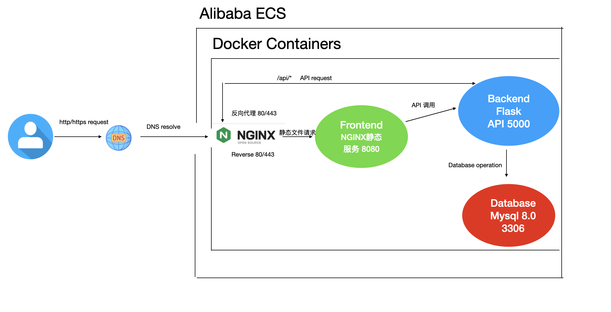

# Docker-compose-web-server-alibaba-cloud

In this tutorial, I will use a standalone alibaba ECS server to deploy a website including frontend, backend, database.

## Project-Architecture



## Usage

- As we know, docker hub was blocked in China, so I need to configure Docker Hub image accelerator on my ECS server.
  
```shell
sudo mkdir -p /etc/docker
sudo tee /etc/docker/daemon.json <<-'EOF'
{
  "registry-mirrors": ["https://qshjcvem.mirror.aliyuncs.com"]
}
EOF
sudo systemctl daemon-reload
sudo systemctl restart docker

# check the current registry-mirrors
docker info | grep -A 2 Mirrors
```
- This is a container environment, on your ECS server you need to install

   - docker
   ```shell
   sudo apt install docker.io -y
   sudo usermod -aG docker ecs-user
   newgrp docker
   ```
   - docker-compose
   ```shell
   sudo apt install docker-compose -y
   ```


- Rebuild and remove all docker-compose include images
```shell
docker-compose down -v --rmi all
```
- Or you can clear and rebuild from the following steps
```shell
docker-compose down
docker system prune -f
docker-compose build --no-cache
docker-compose up -d
```
- Check the backend logs
```shell
docker logs --tail 50 interior_backend
```
- Check the container status
```shell
docker-compose-nginx-web-serve-alibaba-cloud$ docker-compose ps
      Name                     Command                  State                                       Ports                                 
------------------------------------------------------------------------------------------------------------------------------------------
interior_backend    gunicorn --bind 0.0.0.0:50 ...   Up             0.0.0.0:5000->5000/tcp,:::5000->5000/tcp                              
interior_frontend   /docker-entrypoint.sh ngin ...   Up             0.0.0.0:8080->80/tcp,:::8080->80/tcp                                  
interior_mysql      docker-entrypoint.sh mysqld      Up (healthy)   0.0.0.0:3306->3306/tcp,:::3306->3306/tcp, 33060/tcp                   
interior_nginx      /docker-entrypoint.sh ngin ...   Up             0.0.0.0:443->443/tcp,:::443->443/tcp, 0.0.0.0:80->80/tcp,:::80->80/tcp

```
- Test the health check
```shell
curl http://localhost:5000/api/health
```
- Test the root api endpoint
```shell
curl http://localhost:5000/api
```
- Test service api list
```shell
curl http://localhost:5000/api/services
```
- Test api cases
```shell
curl http://localhost:5000/api/cases
```
- visit the frontend website
```shell
curl http://localhost:8080
```

## SSL CA check

- Use this command to check the SSL ca certification 
```shell
ecs-user@iZ0jlf7atzu52g2uhx3spdZ:~/web-server/docker-compose-nginx-web-serve-alibaba-cloud$ openssl s_client -connect 8.130.119.137:443 -servername awsmpc.asia <<< "Q" | openssl x509 -noout -text | grep -A1 "Subject:"
depth=2 C = US, O = DigiCert Inc, OU = www.digicert.com, CN = DigiCert Global Root G2
verify return:1
depth=1 C = US, O = DigiCert Inc, OU = www.digicert.com, CN = Encryption Everywhere DV TLS CA - G2
verify return:1
depth=0 CN = awsmpc.asia
verify return:1
DONE
        Subject: CN = awsmpc.asia
        Subject Public Key Info:

```


